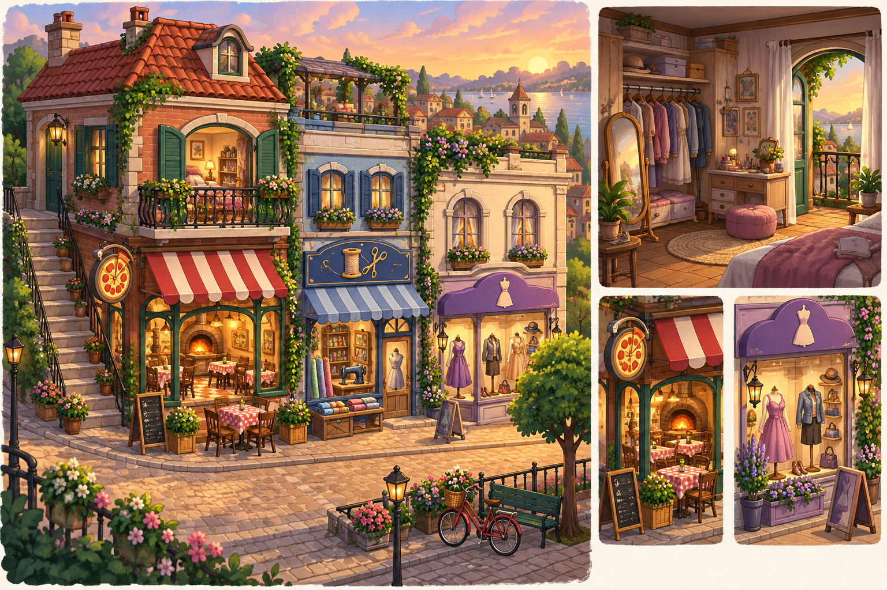
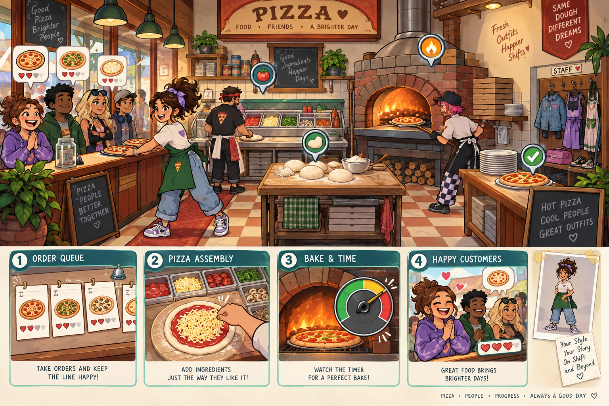
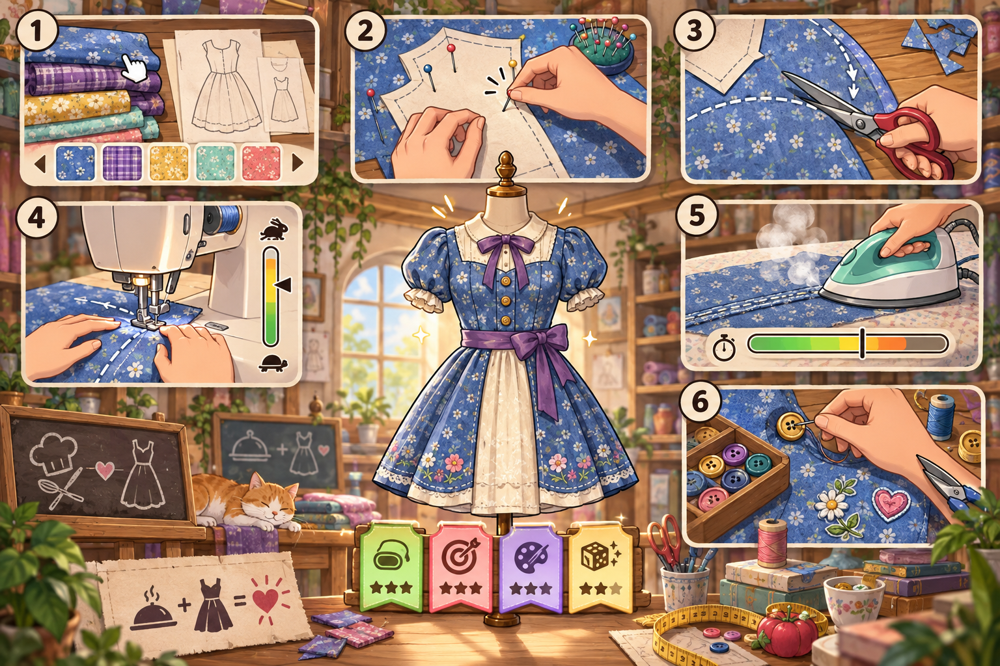
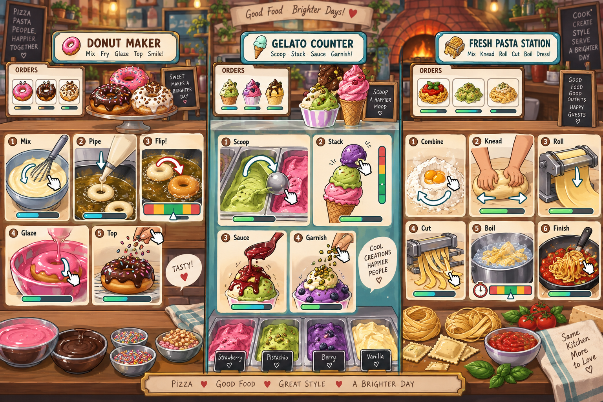

# Slice & Stitch — concept art pass

These are exploratory AI-generated mood and interaction concepts. They are not production sprites and should be redrawn as layered, animation-ready assets after the art direction is approved.

## Town hub and home

What to keep: compact four-destination street, home above the shops, warm late-afternoon light, readable awnings, and the dressing-room inset.

What to change for production: flatten the camera slightly, reduce decorative foliage around click targets, standardize door scale, and reserve more clean screen space for navigation UI.

## Pizzeria service floor

What to keep: separate order, prep, oven, and pass stations; outfit variety among customers and staff; warm oven focal point; immediate illustrated order cards.

What to change for production: one consistent side-on camera, fewer simultaneous characters, simpler background texture, and station hit areas designed at the target mobile resolution.

## Tailoring minigames

What to keep: fabric-first presentation, plausible tool motions, six-step craft journey, tactile close-ups, and the four-part result breakdown.

What to change for production: use abstract hands or a consistent player hand set, add non-color timing cues, separate the pattern-layout step from fabric selection, and simplify the garment reveal for modular rendering.

## Unlockable food stations

What to keep: distinct verbs for each station, three highly legible palettes, compact order cards, and action sequences that can be learned from arrows and animation.

What to change for production: reserve full-screen focus for one active step at a time, unify meters with the pizza station, and remove decorative lettering from gameplay surfaces.

## Proposed visual rules

- Dark warm outlines, with outer silhouettes about twice the thickness of interior lines.
- Cream paper/card surfaces with muted teal framing for system UI.
- Tomato red for urgent restaurant actions; lavender for fashion; green for valid/safe zones.
- Large icons plus shape cues so color is never the only signal.
- Characters use expressive portrait reactions, while gameplay hands stay simple and consistent.
- Food gets specular highlights and particles; cloth gets weave, fold, and stitch details.
- The hub is painterly, but active minigame surfaces are cleaner and higher contrast.

## Translating the concepts into playable screens

The paintings are feasible as visual targets, but they should not be animated or made clickable as flattened images. Rebuild each minigame around one locked work surface and separate the backdrop, tools, ingredients/fabric, hands, effects, UI, and invisible hit geometry. Decorative detail can remain around the perimeter; active areas need simplified texture and unambiguous silhouettes.

The depicted interactions already map to implementable mechanics: pointer paths for sauce, cutting, and sewing; target coverage for cheese and glaze; bounded placement for toppings and buttons; timing windows for ovens, frying, boiling, and pressing; and balance/rhythm meters for scooping, kneading, and machine speed. Art displays state, while deterministic code owns scoring and collisions.

## Time-of-day palette system

Use one approved drawing for all three phases rather than separately regenerating each scene.

| Phase | Palette direction | Practical lights |
|---|---|---|
| Morning | Peach, pale gold, cool mint-blue shadows | Mostly daylight |
| Noon | Clear blue, warm cream, neutral compact shadows | Even task lighting |
| Dusk | Coral, lavender, indigo shadows | Warm lamps, windows, and oven glow |

Each production scene should contain a neutral-color base, interchangeable sky/window plate, fixed shadow mask, warm-light masks, and a phase color grade. This preserves every prop and pixel boundary while allowing controlled palette changes. Full-scene generative edits can help explore the palette, but are not reliable enough to serve as the three canonical production states because small geometry and costume details may drift.

## Recommended next art prototype

Before producing a full asset library, create one production-ready pizza topping screen and one sewing screen at the exact target resolution. Build each from layers, apply all three time-of-day treatments without moving any geometry, and animate the success, near-miss, and failure states. If both remain readable on a small phone and a school Chromebook, lock the UI kit, palette grades, and character proportions.
